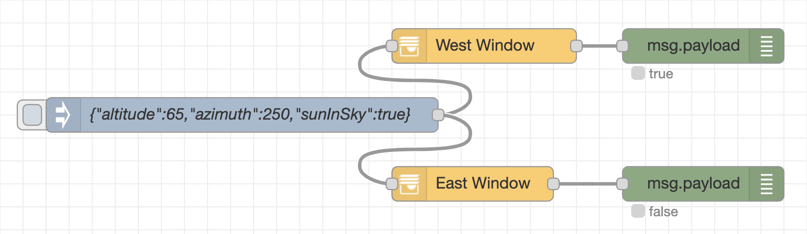

# node-red-contrib-shadow-check

A [Node-RED](http://nodered.org/) node that calculates the shadow coverage of a window on your house.

The node receives the current altitude and azimuth of the sun and emits a boolean payload which tells if the sun shines into the configured window.

This project follows the unix philosophy. So it will *not* calculate the sun position nor check if the sun is actually shining.

## Installation

This node can be installed by searching for `node-red-contrib-shadow-check` in the Palette or running the following command in your Node-RED user directory – typically `~/.node-red`.

```
$ npm install node-red-contrib-shadow-check
```

## Usage


